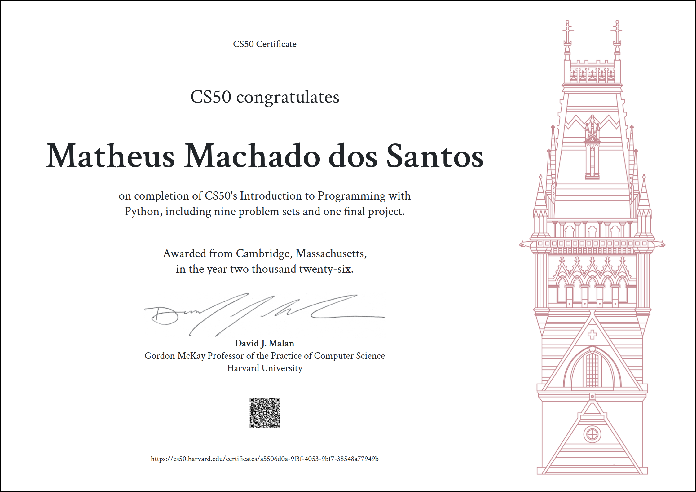

# 💻 exercicios-cs50p-python

Repositório com as **soluções dos exercícios** do curso **“CS50’s Introduction to Programming with Python”**, oferecido pela **Universidade de Harvard**.  
Este projeto foi utilizado para registrar minha **evolução prática em Python ao longo do curso**.

------------------



## 📚 Sobre o curso

O CS50P é um curso introdutório de programação com foco em Python. Durante sua realização, foram abordados desde conceitos básicos até tópicos mais avançados, incluindo:

- Tipos de dados e variáveis  
- Condicionais e loops  
- Funções e escopo  
- Estruturas de dados (listas, dicionários e sets)  
- Leitura e escrita de arquivos  
- Programação orientada a objetos (POO)  
- Expressões regulares  
- Testes, módulos e boas práticas de código  

------------------

## 📁 Estrutura do repositório

Cada pasta `pset/` corresponde a um conjunto de problemas (**problem sets**) resolvidos ao longo do curso.  
O diretório `projeto-final/` reúne o **projeto final desenvolvido**, no qual foram integrados diversos conceitos aprendidos durante as aulas.

```plaintext
cs50p/
├── pset0/
│   ├── indoor.py
│   ├── playback.py
│   ├── faces.py
│   ├── einstein.py
│   └── tip.py
│
├── pset1/
│   ├── deep.py
│   ├── bank.py
│   ├── extensions.py
│   ├── interpreter.py
│   └── meal.py
|
├── pset2/
│   ├── camel.py
│   ├── coke.py
│   ├── twttr.py
│   ├── plates.py
│   └── nutrition.py
|
├── pset3/
│   ├── fuel.py
│   ├── taqueria.py
│   ├── grocery.py
│   └── outdated.py
|
├── pset4/
│   ├── emojize.py
│   ├── figlet.py
│   ├── adieu.py
│   ├── game.py
│   ├── professor.py
│   └── bitcoin.py
|
├── pset5/
│   ├── test_twttr.py
│   ├── test_bank.py
│   ├── test_plates.py
│   └── test_fuel.py
|
├── pset6/
│   ├── lines.py
│   ├── pizza.py
│   ├── scourgify.py
│   └── shirt.py
|
├── pset7/
│   ├── numb3rs.py
│   ├── watch.py
│   ├── working.py
│   ├── um.py
│   └── response.py
|
├── pset8/
│   ├── seasons.py
│   ├── jar.py
│   └── shirtificate.py
│
├── projeto-final/
│   ├── project.py
│   └── test_project.py
